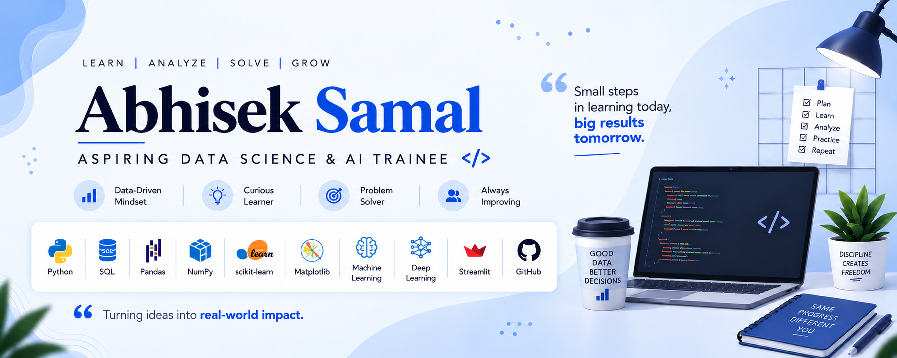

 
# 👋 Hey, I'm Abhisek Samal

### 🚀 Aspiring Data Science & AI Trainee

------------------------------------------------------------------------

## 🧑‍💻 About Me
Name: Abhisek Samal

Location: Bangalore, India

I'm an aspiring Data Science and AI tranee passionate about
turning data into meaningful insights and building intelligent
applications.

I'm currently developing my skills in:

- 🐍 Python
- 🗄️ SQL
- 📊 Data Analysis
- 📈 Data Visualization
- 🤖 Machine Learning
- 🌐 Streamlit
- 🧠 Generative AI
- 🔗 LangChain

My goal is to build practical Data Science and AI applications that
solve real-world problems.

------------------------------------------------------------------------
---

# 🧠 My Data Science Journey

### 🗄️ SQL → 🐍 Python → 🔢 NumPy → 🐼 Pandas

### 📊 Data Analysis → 📈 Visualization → 🤖 Machine Learning

### 🌐 Streamlit → 🧠 Generative AI → 🔗 LangChain

### 🚀 Real-World AI Applications

---

# 🛠️ Tech Stack

 

**Python • SQL • NumPy • Pandas • Matplotlib • Scikit-learn • Streamlit**

# 📚 Skills I'm Building

  Area                  Skills
  --------------------- ------------------------
  🐍 Programming        Python
  🗄️ Database           SQL
  📊 Data Analysis      Pandas • NumPy
  📈 Visualization      Matplotlib • Plotly
  🤖 Machine Learning   Scikit-learn
  🌐 Deployment         Streamlit
  🧠 Generative AI      LLMs • GenAI
  🔗 AI Frameworks      LangChain
  🧰 Tools              Git • GitHub • VS Code

---

# 🏆 Certifications

🎖️ BOSTON INSTITUTE OF ANALYTICS - Data Science & Artificial Intelligence

🎖️ Prepinsta — DBMS Nano Degree 

🎖️ Prepinsta — Cloud Computing Nano Degree 

🎖️ Prepinsta — SQL Nano Degree 

🎖️ Acmegrade — Cloud Computing Internship

---

------------------------------------------------------------------------

# 🌱 My Philosophy

> **"Don't just learn technology. Build something with it."**

### Learn → Build → Experiment → Improve

Every project is another step forward. 🚀

------------------------------------------------------------------------

# 💬 Let's Connect

---

### ⚡ Learn → Build → Experiment → Improve

⭐ Thanks for visiting my profile!

